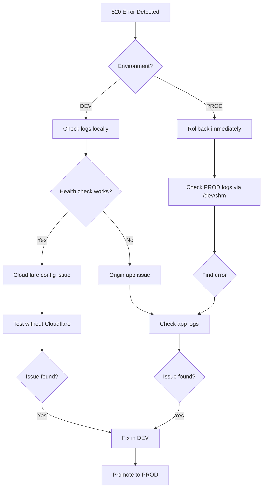

# 🚨 Cloudflare 520 Emergency Response Guide

**When you see 520 errors: DON'T PANIC. FOLLOW THIS GUIDE.**

---

## 🎯 Immediate Actions (First 30 Seconds)

### 1. Check the Environment
**Ask yourself:**
- Is this **DEV** (zosite) or **PROD** (public)?
- **DEV:** Safe to experiment, breakage allowed
- **PROD:** Rollback immediately, no experiments

### 2. Check /health Endpoint
```bash
# If PROD - check via Cloudflare
curl https://neighborgigs.dev/health

# If DEV - check locally
curl http://localhost:50430/health
```

**✅ If 200 OK:** Origin is working, Cloudflare issue
**❌ If error:** Origin problem, investigate further

### 3. Check Recent Changes
```bash
# What was deployed last?
git log --oneline -5

# Any recent commits?
git status
```

---

## 🎯 30-Second Decision Tree



---

## 🔧 PROD Emergency Actions

### If 520 hits PROD:
1. **STOP EVERYTHING** - Do not deploy more
2. **ROLLBACK NOW** - Use previous working version
3. **CHECK /health** via bypass (test subdomain)
4. **SAVE LOGS** before fixing anything
5. **IDENTIFY** root cause in DEV environment

### Emergency Rollback Script
```bash
#!/bin/bash
# Run this immediately when 520 detected in PROD

echo "🚨 EMERGENCY ROLLBACK INITIATED"

# 1. Stop current service
echo "Stopping current service..."
pm2 delete neighborgigs 2>/dev/null || true

# 2. Restore previous version
echo "Restoring previous version..."
cd /home/workspace/neighborgigs
git checkout HEAD~1

# 3. Rebuild
echo "Rebuilding..."
bun run build

# 4. Start previous version
echo "Starting previous version..."
NODE_ENV=production PORT=58289 bun run prod &
sleep 3

# 5. Verify health
echo "Verifying health..."
curl -f http://localhost:58289/health && echo "✅ Rollback successful" || echo "❌ Rollback failed"

# 6. Check logs
echo "Recent logs:"
tail -n 20 /dev/shm/prod.log 2>/dev/null || echo "No logs yet"
```

### Access PROD Logs
```bash
# Check recent errors
tail -n 100 /dev/shm/prod.log 2>/dev/null | grep -E "(error|520|crash|reset)"

# Real-time monitoring
tail -f /dev/shm/prod.log 2>/dev/null

# Check all service logs
ls -la /dev/shm/
for log in /dev/shm/*.log; do
  echo "=== $log ==="
  tail -n 10 "$log" 2>/dev/null
done
```

---

## 🔧 DEV Diagnostic Actions

### If 520 hits DEV:
1. **Don't panic** - This is expected
2. **Run diagnostic script**:
```bash
cd /home/workspace/neighborgigs
bun scripts/520-diagnose.ts [domain] dev
```

3. **Check logs**:
```bash
tail -n 100 /dev/shm/zosite.log 2>/dev/null || echo "No logs yet"
```

4. **Test without Cloudflare**:
```bash
curl -I http://localhost:50430/
curl http://localhost:50430/health
```

### Common DEV 520 Causes & Fixes

#### Cause 1: App crashed after accepting connection
**Symptoms:** 520 on all requests, no logs, container restarting
**Check:**
```bash
# Check if container is running
docker ps | grep zosite
# or
pm2 list
```

**Fix:**
```bash
# Check error logs
tail -n 50 /dev/shm/zosite.log

# Check env vars
env | grep -E "(SUPABASE|ZO_CLIENT)"

# Restart manually
pm2 restart all
```

#### Cause 2: Empty response with headers
**Symptoms:** 520, curl shows headers but no body
**Check:**
```bash
curl -v http://localhost:50430/health
```

**Fix:**
```typescript
// Add to server.ts
app.get("/health", (c) => {
  return c.json({
    status: "ok",
    timestamp: new Date().toISOString(),
    contentLength: "explicit" // Ensure Content-Length is set
  });
});
```

#### Cause 3: Invalid HTTP response
**Symptoms:** 520, logs show "invalid response"
**Check:**
```bash
# Look for console.log output
tail -n 50 /dev/shm/zosite.log | grep "console.log"

# Check for binary output
curl http://localhost:50430/ | xxd | head -20
```

**Fix:**
```typescript
// Remove all console.log in route handlers
// Ensure responses are properly formatted

app.get("/api/hello-zo", (c) => {
  // BAD: console.log("Hello");
  return c.json({ msg: "Hello from Zo" });
});
```

#### Cause 4: Missing env vars
**Symptoms:** 520 on startup, early crash
**Check:**
```bash
# Check env vars
env | grep -E "(SUPABASE|ZO_CLIENT|NODE_ENV)"

# Check config
cat zosite.json
```

**Fix:**
```bash
# Add missing env vars to zosite.json
# Or set them before running
export SUPABASE_URL="..."
export SUPABASE_SERVICE_ROLE_KEY="..."
```

#### Cause 5: Port conflict
**Symptoms:** 520, "port already in use"
**Check:**
```bash
# Check what's using port
lsof -i :50430

# Or check if server is actually listening
curl http://localhost:50430/health
```

**Fix:**
```bash
# Kill existing process
pkill -f "bun.*server.ts"

# Or kill by port
fuser -k 50430/tcp

# Restart
bun run dev-api
```

---

## 🔍 Root Cause Investigation

### Step 1: Check Application Logs
```bash
# For DEV
tail -n 100 /dev/shm/zosite.log 2>/dev/null

# For PROD (after rollback)
tail -n 100 /dev/shm/prod.log 2>/dev/null

# Look for:
# - segmentation fault
# - worker exited
# - error: ...
# - 520
# - invalid response
```

### Step 2: Check Headers
```bash
# Check if response has proper headers
curl -v http://localhost:50430/health 2>&1 | grep -E "(HTTP|<|>)"

# Should see:
# HTTP/1.1 200 OK
# Content-Type: application/json
# Content-Length: [number]
```

### Step 3: Check Response Body
```bash
# Check response body
curl http://localhost:50430/health

# Should see:
# {"status":"ok",...}
```

### Step 4: Check Response Time
```bash
# Check if request times out
time curl http://localhost:50430/health

# If > 30s, likely timeout issue
```

### Step 5: Test Endpoints
```bash
# Test each endpoint
curl http://localhost:50430/health
curl http://localhost:50430/
curl http://localhost:50430/api/hello-zo

# Note which one fails
```

---

## 📊 Cloudflare Dashboard Checks

### When to Check Dashboard
1. **If 520 only via Cloudflare** (works on origin)
2. **To verify SSL mode**
3. **To check error rates**
4. **To see analytics**

### What to Look For
1. **SSL/TLS Settings**
   - Mode: Should be **Full (Strict)**
   - Certificate: Should be valid

2. **DNS Records**
   - Proxied status (orange cloud)
   - A record points to correct origin

3. **Analytics**
   - 520 error rate > 0
   - Origin response time > 5s
   - SSL handshake failures

4. **Page Rules**
   - Any rule causing 520
   - Cache settings
   - SSL rules

---

## 🚨 Common 520 Scenarios & Exact Fixes

### Scenario 1: Flexible SSL (Most Common)
**Symptoms:** 520 only via Cloudflare, works locally
**Proof:** curl https://yourdomain.com works, but 520 via browser
**Root Cause:** SSL mode is "Flexible"
**Fix:**
```bash
# Via Cloudflare API
bun scripts/cloudflare-api.ts set-ssl strict

# Or manually: Cloudflare Dashboard → SSL/TLS → Full (Strict)
```

### Scenario 2: App Crash Under Load
**Symptoms:** 520 after some time, then recovers
**Proof:** Logs show "worker exited" or "segfault"
**Root Cause:** Memory leak or unhandled rejection
**Fix:**
```typescript
// Add error handling
process.on('uncaughtException', (error) => {
  console.error('Uncaught Exception:', error);
  // Don't crash
});

process.on('unhandledRejection', (reason, promise) => {
  console.error('Unhandled Rejection at:', promise, 'reason:', reason);
  // Don't crash
});

// Add memory monitoring
setInterval(() => {
  const used = process.memoryUsage();
  console.log({
    memory: {
      rss: `${Math.round(used.rss / 1024 / 1024)} MB`,
      heapTotal: `${Math.round(used.heapTotal / 1024 / 1024)} MB`,
      heapUsed: `${Math.round(used.heapUsed / 1024 / 1024)} MB`,
    }
  });
}, 30000); // Every 30s
```

### Scenario 3: Database Connection Exhaustion
**Symptoms:** 520 on database queries, works on static files
**Proof:** Logs show connection pool errors
**Root Cause:** Database connections not released
**Fix:**
```typescript
// Use connection pooling properly
import { Pool } from 'pg';

const pool = new Pool({
  max: 10, // Limit connections
  idleTimeoutMillis: 30000,
  connectionTimeoutMillis: 2000,
});

// Always release connections
app.get('/api/data', async (c) => {
  const client = await pool.connect();
  try {
    const result = await client.query('SELECT * FROM table');
    return c.json(result.rows);
  } finally {
    client.release(); // CRITICAL: Always release
  }
});
```

### Scenario 4: HTTP/2 → HTTP/1.1 Mismatch
**Symptoms:** 520 only on some requests
**Proof:** Mixed content errors in browser
**Root Cause:** Cloudflare sends HTTP/2, origin expects HTTP/1.1
**Fix:**
```typescript
// Ensure server handles both protocols
export default {
  fetch: app.fetch,
  port: 50430,
  idleTimeout: 255, // Bun supports HTTP/1.1 and HTTP/2
};
```

### Scenario 5: Timeout Mismatch
**Symptoms:** 520 on slow requests (>30s)
**Proof:** Logs show "timeout" or "upstream prematurely closed"
**Root Cause:** Origin timeout < Cloudflare timeout
**Fix:**
```typescript
// Increase timeout in server.ts
export default {
  fetch: app.fetch,
  port: 50430,
  idleTimeout: 255, // 255 seconds max
};

// Or per-route timeout
app.get('/api/slow', async (c) => {
  // Add timeout check
  const start = Date.now();
  const result = await longRunningTask();
  const duration = Date.now() - start;
  
  if (duration > 30000) {
    console.warn('Slow request:', duration, 'ms');
  }
  
  return c.json(result);
});
```

---

## 🔍 Log Analysis Commands

### Find 520-related errors
```bash
# Check all logs for 520 patterns
grep -r "520" /dev/shm/ 2>/dev/null

# Check for crashes
grep -r -E "(crash|segfault|worker exited)" /dev/shm/ 2>/dev/null

# Check for timeouts
grep -r -E "(timeout|prematurely closed)" /dev/shm/ 2>/dev/null

# Check for invalid responses
grep -r -E "(invalid response|header too large)" /dev/shm/ 2>/dev/null
```

### Tail logs in real-time
```bash
# Follow all logs
tail -f /dev/shm/*.log 2>/dev/null

# Or specific log
tail -f /dev/shm/zosite.log 2>/dev/null
```

### Check recent errors
```bash
# Last 50 lines, filter errors
tail -n 50 /dev/shm/zosite.log 2>/dev/null | grep -i error

# Last hour of logs
find /dev/shm/ -name "*.log" -mmin -60 -exec tail -n 20 {} \;
```

---

## ✅ Verification Checklist

### After Fix Applied (DEV)
- [ ] /health returns 200
- [ ] All endpoints respond
- [ ] No errors in logs for 5 minutes
- [ ] Response headers valid
- [ ] Response time < 5 seconds
- [ ] Health check JSON is valid

### After Fix Deployed (PROD)
- [ ] /health returns 200 via Cloudflare
- [ ] /health returns 200 via gray cloud
- [ ] No 520 errors for 10 minutes
- [ ] Response time < 5 seconds
- [ ] SSL certificate valid
- [ ] Cloudflare cache working
- [ ] Page loads correctly

### Monitoring for 24 Hours
- [ ] Health check monitoring
- [ ] Error rate monitoring
- [ ] Response time monitoring
- [ ] SSL/TLS validity
- [ ] Database connection pool health

---

## 📞 Escalation

### If You Cannot Fix:
1. **Save all logs**:
```bash
# Collect logs
cp /dev/shm/*.log ~/logs-backup/ 2>/dev/null
# or
tail -n 1000 /dev/shm/*.log > ~/logs-backup/$(date +%s).log
```

2. **Document the issue**:
```bash
# Run diagnostic
bun scripts/520-diagnose.ts [domain] [dev|prod]

# Save output
bun scripts/520-diagnose.ts [domain] [dev|prod] > diagnostic-$(date +%Y%m%d-%H%M%S).txt
```

3. **Contact support**:
- Zo Team: https://support.zocomputer.com
- Email: help@zocomputer.com
- Discord: https://discord.gg/invite/zocomputer

### Information to Provide:
- Environment (DEV/PROD)
- Domain
- Time of error
- Logs (last 100 lines)
- Diagnostic output
- Recent changes
- /health endpoint response

---

## 🎯 Key Takeaways

1. **PROD 520 → Rollback immediately, fix in DEV**
2. **DEV 520 → Expected, fix in DEV, promote**
3. **Always check /health first**
4. **Always check logs second**
5. **Always test without Cloudflare third**
6. **Fix in DEV, promote to PROD**
7. **Never debug live PROD**

**Remember:** Cloudflare 520 means origin sent garbage. Fix origin, not Cloudflare.
